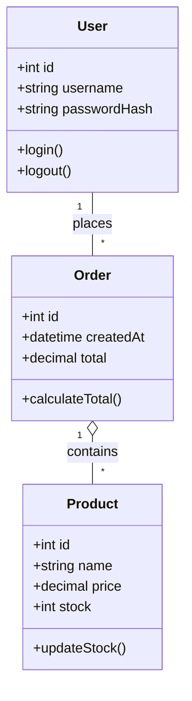
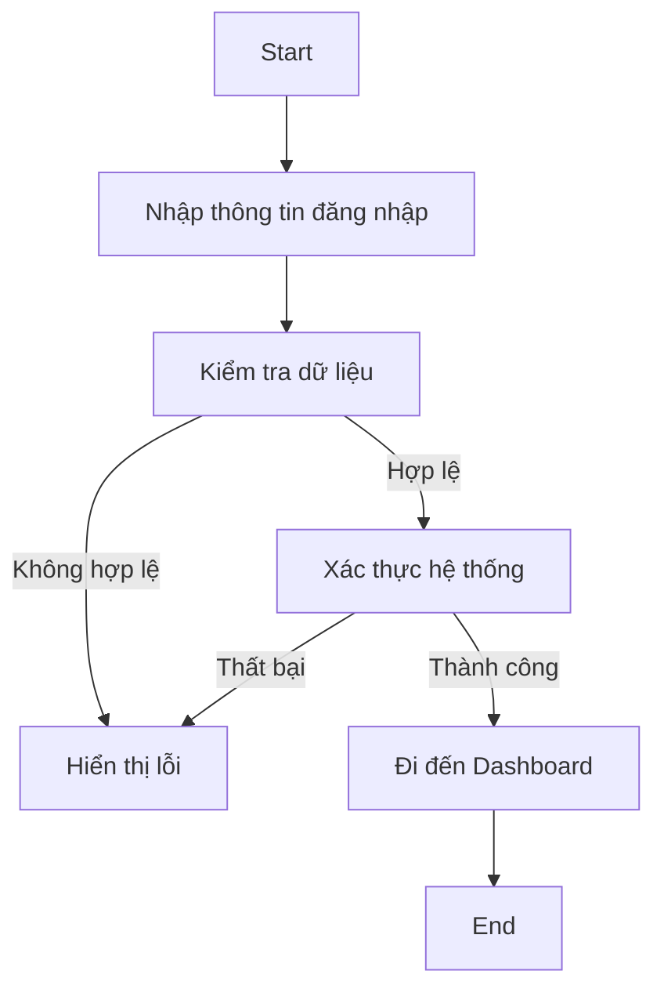
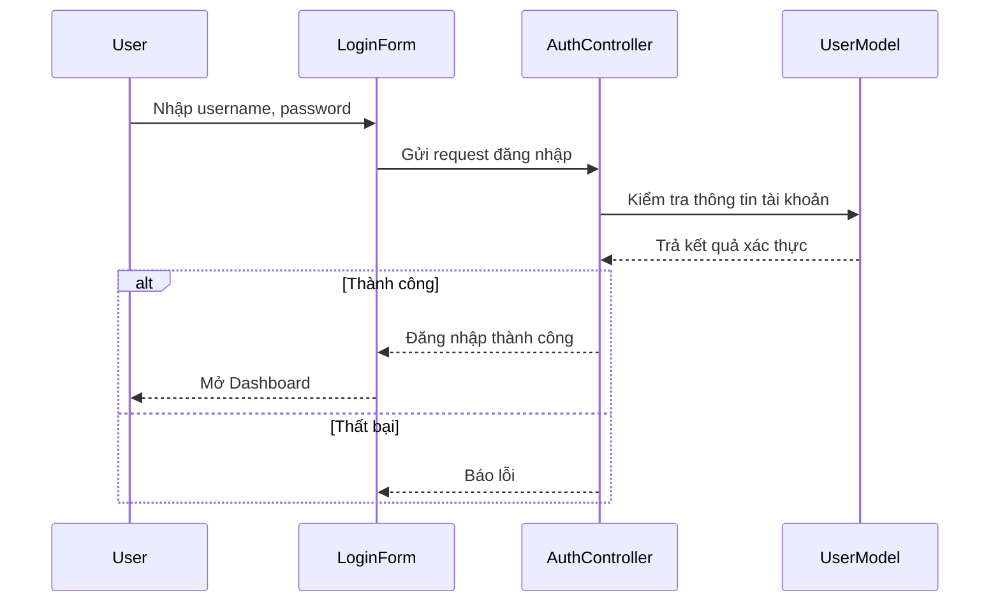
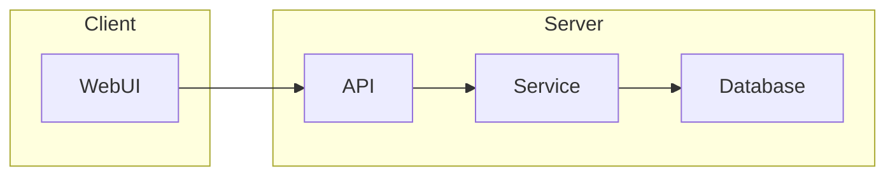
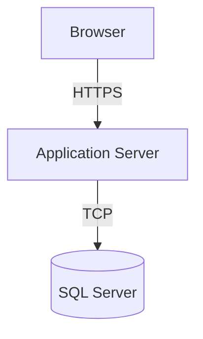

# 🧪 LAB CHƯƠNG 7 – THIẾT KẾ PHẦN MỀM

## 📘 Giới thiệu

File này đóng vai trò như **README.md** cho bài **Lab 07 – Thiết kế phần mềm**. Sinh viên thực hiện các phần thiết kế UML, giao diện, CSDL và kiến trúc phần mềm theo hướng dẫn bên dưới.

---

## 🔹 Lab 7.1 – Biểu đồ lớp (Class Diagram)

**Yêu cầu:**

* Xác định các lớp bằng 2 phương pháp:

  * **Noun Phrase:** tìm danh từ trong mô tả bài toán.
  * **Use Case Driven:** dựa theo các chức năng chính của hệ thống.
* Phân loại lớp thành 3 nhóm: `Entity`, `Boundary`, `Control`.
* Vẽ **Class Diagram** thể hiện thuộc tính, phương thức và quan hệ giữa các lớp.

**Ví dụ sơ bộ:**



---

## 🔹 Lab 7.2 – Biểu đồ hoạt động (Activity Diagram)

**Use Case được chọn:** `Đăng nhập`

**Flow of Events:**

* **Preconditions:** Người dùng đã có tài khoản.
* **Main Flow:**

  1. Nhập username & password.
  2. Hệ thống xác thực thông tin.
  3. Nếu đúng → chuyển đến Dashboard.
  4. Nếu sai → báo lỗi.
* **Alternative Flow:** Quên mật khẩu hoặc tài khoản bị khóa.

**Biểu đồ:**



---

## 🔹 Lab 7.3 – Biểu đồ tương tác (Sequence & Collaboration)

**Sequence Diagram – Use Case: Đăng nhập**



---

## 🔹 Lab 7.4 – Biểu đồ thành phần & triển khai

**Component Diagram:**



**Deployment Diagram:**



---

## 🔹 Lab 7.5 – Thiết kế giao diện & CSDL

### 🎨 Giao diện người dùng (UI)

* Trang đăng nhập (Login)
* Trang chính (Dashboard)
* Trang quản lý sản phẩm (Product List)

### 🧱 Cơ sở dữ liệu (Database)

**Bảng chính:** Users, Products, Orders, OrderItems
**Quan hệ:**

* `Orders.UserId` → `Users.Id`
* `OrderItems.OrderId` → `Orders.Id`
* `OrderItems.ProductId` → `Products.Id`

**SQL mẫu:**

```sql
CREATE DATABASE Lab07DB;
GO
USE Lab07DB;

CREATE TABLE Users (
    Id INT IDENTITY PRIMARY KEY,
    Username NVARCHAR(100) NOT NULL UNIQUE,
    PasswordHash NVARCHAR(255) NOT NULL
);

CREATE TABLE Products (
    Id INT IDENTITY PRIMARY KEY,
    Name NVARCHAR(200),
    Price DECIMAL(18,2),
    Stock INT
);

CREATE TABLE Orders (
    Id INT IDENTITY PRIMARY KEY,
    UserId INT,
    Total DECIMAL(18,2),
    CONSTRAINT FK_Orders_Users FOREIGN KEY (UserId) REFERENCES Users(Id)
);
```

---

## 🔹 Lab 7.6 – Kiến trúc phần mềm (Demo nhỏ)

**Chọn mô hình:** `MVC` hoặc `SOA`

### 📁 Cấu trúc thư mục mẫu (MVC)

```
/MyApp
 ┣ /Controllers
 ┃ ┣ AuthController.cs
 ┃ ┗ ProductController.cs
 ┣ /Models
 ┃ ┣ User.cs
 ┃ ┗ Product.cs
 ┣ /Views
 ┃ ┣ /Auth/Login.cshtml
 ┃ ┗ /Product/Index.cshtml
 ┗ /Data/ApplicationDbContext.cs
```

**Triển khai bằng Visual Studio:**

1. Tạo project ASP.NET Core MVC.
2. Cấu hình `appsettings.json` để kết nối SQL Server.
3. Dùng `Add-Migration` và `Update-Database` để tạo CSDL.
4. Chạy thử bằng F5.

---

## ✅ Hoàn thành

Sinh viên cần nộp đầy đủ các biểu đồ UML, script SQL và demo ứng dụng theo yêu cầu.
**Khuyến khích:** chụp ảnh sơ đồ UML (draw.io / StarUML) và đính kèm vào file nộp.

---

> 📎 Gợi ý mở rộng: Có thể bổ sung phần đánh giá, báo cáo hoặc hướng phát triển hệ thống ở cuối README để tăng điểm trình bày.
