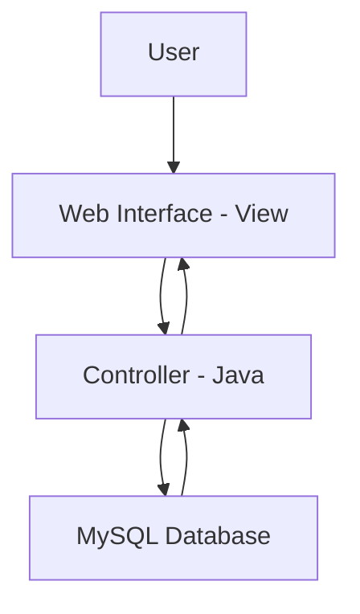
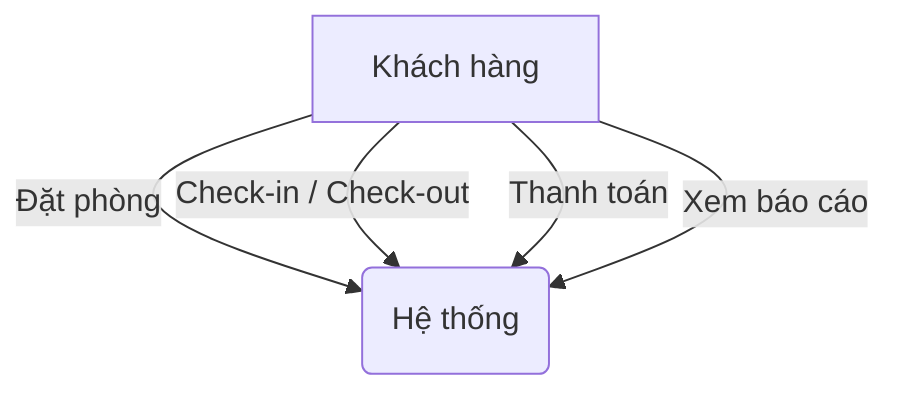
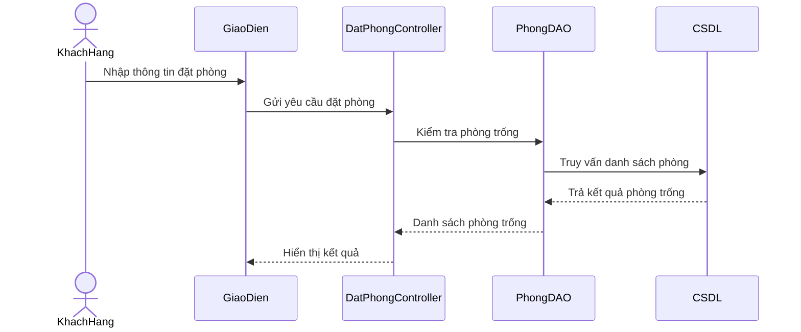
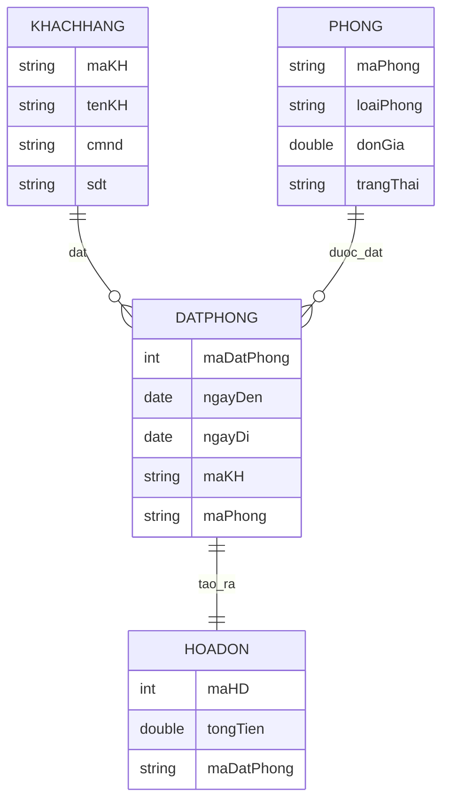
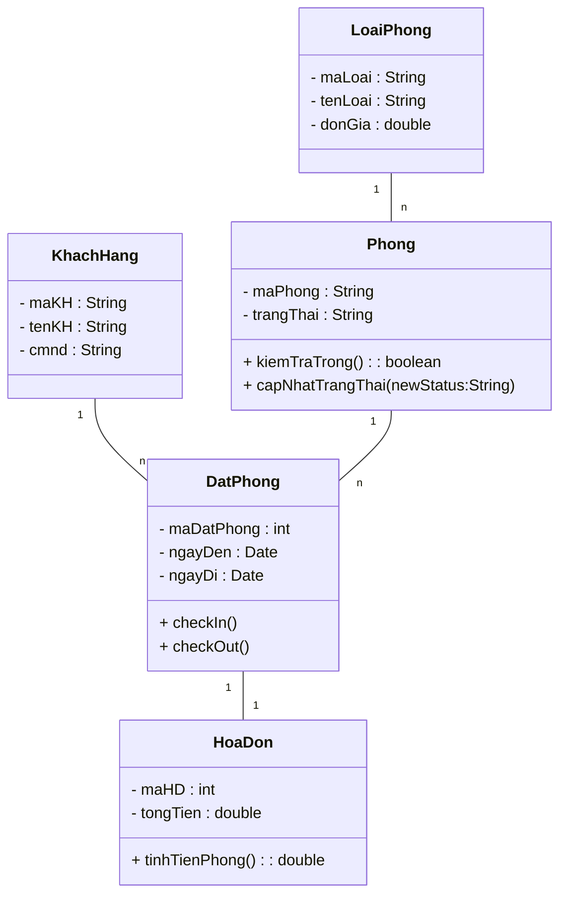

# 🏨 Hotel Management System


---

## 📑 Table of Contents

- [Giới thiệu](#-giới-thiệu)
- [Công nghệ sử dụng](#-công-nghệ-sử-dụng)
- [Thiết kế hệ thống](#-thiết-kế-hệ-thống)
  - [Use Case Diagram](#use-case-diagram)
  - [Sequence Diagram](#sequence-diagram)
  - [ERD (Entity Relationship Diagram)](#erd-entity-relationship-diagram)
  - [Class Diagram](#class-diagram)
- [Cài đặt & chạy thử](#-cài-đặt--chạy-thử)
- [Nhật ký Lab & Tiến độ](#-nhật-ký-lab--tiến-độ)

---

## 🏷️ Giới thiệu

**Hotel Management System** là ứng dụng giúp quản lý các hoạt động của khách sạn bao gồm **đặt phòng, check-in/check-out, thanh toán và báo cáo doanh thu**.  
Dự án được phát triển trong khuôn khổ môn **Nhập môn Công nghệ Phần mềm**, áp dụng quy trình **Agile – Scrum**.

**Mục tiêu:** Áp dụng quy trình phát triển phần mềm đầy đủ, bao gồm:
- Phân tích yêu cầu  
- Thiết kế hệ thống  
- Lập trình và kiểm thử  
- Triển khai và báo cáo  

Hệ thống cho phép quản lý toàn bộ hoạt động khách sạn như đặt phòng, check-in, dịch vụ và thanh toán.

---

## 👥 Thành viên nhóm
- Họ và tên: **Cao Nguyễn Anh Sơn**
- MSSV: **B24DTCN496**
- LỚP: **D24TXCN12-B**

---

## 💻 Công nghệ sử dụng

| Thành phần | Công nghệ | Mô tả |
|-------------|------------|-------|
| **Ngôn ngữ** | Java / Python / JavaScript | Xử lý logic và giao diện |
| **IDE** | Visual Studio Code / IntelliJ IDEA | Môi trường phát triển |
| **CSDL** | MySQL | Lưu trữ thông tin khách sạn |
| **Quản lý mã nguồn** | Git + GitHub | Lưu trữ, cộng tác, quản lý phiên bản |
| **Mô hình phát triển** | Agile – Scrum | Tổ chức quy trình linh hoạt |

---

## 🧩 Thiết kế hệ thống

Hệ thống **Hotel Management System** được thiết kế theo mô hình **MVC (Model – View – Controller)**:

- **Model**: Quản lý dữ liệu khách hàng, phòng, đặt phòng, hóa đơn.  
- **View**: Giao diện hiển thị (HTML/CSS/JavaFX hoặc Web UI).  
- **Controller**: Xử lý logic nghiệp vụ như đặt phòng, check-in/check-out, thanh toán.

### 🧱 System Architecture



---

### Use Case Diagram



---

### Sequence Diagram
*(mô tả luồng tương tác giữa Actor – Boundary – Control – Entity)*



---

### ERD (Entity Relationship Diagram)
*(mô hình quan hệ dữ liệu – MySQL)*



---

### Class Diagram



---

## 🚀 Cài đặt & chạy thử

```bash
# Clone repository
git clone https://github.com/caosoncourse-del/NMCNPM1.git
cd NMCNPM1

# Cài đặt cơ sở dữ liệu
# (Chi tiết xem tại docs/DATABASE.md)

# Chạy ứng dụng
# (Hướng dẫn chi tiết trong docs/INSTALL.md)
```

---

## 🧪 Nhật ký Lab & Tiến độ

### 🧩 Lab 01 – Thiết lập môi trường & Quản lý dự án
**Mục tiêu:** Làm quen với Git, GitHub và công cụ lập trình.

- Tạo tài khoản GitHub, repository riêng.  
- Cấu hình Git (clone, commit, push, pull).  
- Upload bài tập giới thiệu bản thân.

---

### 📊 Lab 02 – Phân tích yêu cầu & Thiết kế Use Case
**Mục tiêu:** Mô tả yêu cầu hệ thống bằng UML.

- Chọn project: **Hotel Management System**  
- Vẽ Use Case Diagram và viết Use Case Description.  
- Upload diagram (.png hoặc .drawio).

---

### 🧠 Lab 03 – UML Thiết kế (Use Case & Sequence)
**Mục tiêu:** Diễn tả luồng tương tác chi tiết trong hệ thống.

- Vẽ Use Case Diagram, Sequence Diagram cho quy trình Đặt phòng.  
- Giải thích Actor, Boundary, Control, Entity.

---

### 💻 Lab 04 – Coding giao diện đăng nhập
**Mục tiêu:** Áp dụng kỹ năng lập trình front-end.

- Tạo Form Login (HTML/CSS/JS hoặc JavaFX).  
- Input: Username, Password + nút Login/Cancel.  
- Kiểm tra dữ liệu nhập hợp lệ.

---

### 🧱 Lab 05 – Tích hợp, quản lý & báo cáo
**Mục tiêu:** Hoàn thiện quy trình phần mềm từ thiết kế đến triển khai.

- Gom tất cả các artifacts (UML, code, form).  
- Viết Project Report mô tả quy trình làm việc.  
- Tạo tag version `v1.0`, cập nhật README.

---

### 🏗️ Lab 06 – Thiết kế lớp & kiến trúc hệ thống
**Mục tiêu:** Thiết kế Class Diagram và Package Diagram.

- Sử dụng PlantUML / draw.io / VS Code.

---

### 🧱 Lab 07 – Phát triển Module Đặt phòng (Booking)
**Ngôn ngữ:** Java hoặc Python + MySQL connector.

```python
import mysql.connector, datetime

def kiem_tra_phong(maLoaiPhong, ngayDen, ngayDi):
    print(f"Kiểm tra phòng loại {maLoaiPhong} từ {ngayDen} đến {ngayDi}")
    return "P101"  # ví dụ có phòng trống

def dat_phong(maKH, maLoaiPhong, ngayDen, ngayDi):
    conn = mysql.connector.connect(user="root", password="123456", database="hotel_demo")
    cur = conn.cursor()
    try:
        conn.start_transaction()
        phong_trong = kiem_tra_phong(maLoaiPhong, ngayDen, ngayDi)
        if not phong_trong:
            raise Exception("Hết phòng trống")
        cur.execute("UPDATE Phong SET trangThai='DaDat' WHERE maPhong=%s", (phong_trong,))
        cur.execute("INSERT INTO DatPhong(maKH, maPhong, ngayDen, ngayDi, trangThai) VALUES(%s, %s, %s, %s, 'PENDING')",
                    (maKH, phong_trong, ngayDen, ngayDi))
        conn.commit()
        print(f"Đặt phòng {phong_trong} cho khách {maKH} thành công.")
    except Exception as e:
        conn.rollback()
        print(f"Lỗi đặt phòng: {e}")
    finally:
        conn.close()
```

---

### 🧪 Lab 08 – Kiểm thử (Unit & Integration)
**Công cụ:** PyTest / JUnit / Selenium

- Viết test cho `kiem_tra_phong()` và `dat_phong()`.  
- Test login form (Lab 04) bằng Selenium.  
- Xuất báo cáo pass/fail.

---

### 📋 Lab 09 – Quản lý dự án trên Jira (Agile)
**Mục tiêu:** Mô phỏng phát triển phần mềm bằng Scrum.

- Tạo Project Jira: “Hotel Management System”  
- Epic: Quản lý Lưu trú Khách hàng  
- User Stories: Đặt phòng, Check-in, Check-out, Báo cáo.  
- Sprint 1: 2 tuần – Đặt phòng & Check-in.  
- Chụp ảnh Backlog, Board, Burndown Chart.

---

### 🎓 Lab 10 – Báo cáo tổng hợp & Demo cuối kỳ
**Mục tiêu:** Tổng hợp tất cả các lab thành Mini Project hoàn chỉnh.

- Thu thập tất cả artifact: UML, ERD, Form, Module, Test, Jira.  
- Viết `final-report.md` mô tả dự án.  
- Demo form Login → Đặt phòng → Thanh toán → Báo cáo.  
- Nộp: `final-report.md`, slide PPT, link repo GitHub.

---

<p align="center">💡 <b>Hotel Management System – Từ phân tích đến triển khai hoàn chỉnh!</b></p>
